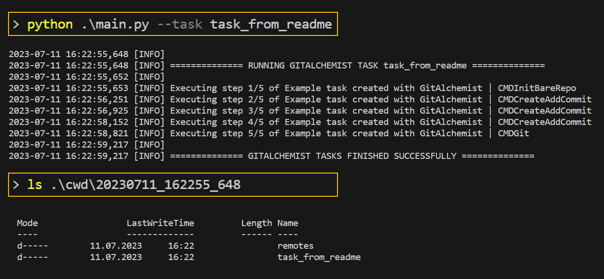
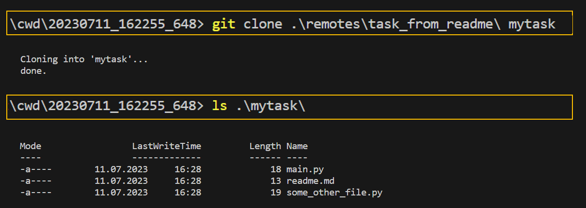

# GitAlchemist

GitAlchemist is a small framework for creating bare repositories from config files on
local disc with a pre-defined history of commits. The primary purpose of this tool
is setting up interactive tasks for git workshops or git tutorials.

## Our Vision

Assume you want participants to get familiar with `git status` or `git log` or
some other commands. You could now set up a git repo and manually add / commit
files there, hand the URL over to your workshop participants and let them play around.
However, this approach has several drawbacks:

- Access to git repo must be provided
- All "historical" commits in the repo are done by one author which could be irritating
- Changes to the repositories (push) is difficult when you have multiple participants
- Tasks for more complex topics are hard to create
- Re-use of tasks is difficult, especially when you allow live changes by participants
- Sharing your material with the community is difficult

We address all the above challenges with GitAlchemist.
Idea is that the **workshop organizers use GitAlchemist to prepare tasks that can be auto-generated from a set of config files**.
The framework will put out one remote repository for each task which can be zipped and sent to participants.
They can then simply work with a local repo on their notebook.
No remote server. No problems with multiple users. No costs.
You could even do this without Internet access. Only difference to a "real"
git repository is that you use `git clone tasks/task0` instead of `git clone https://...`

> **Note**
> GitAlchemist itself is not required in the workshop nor do the participants need any knowledge about how GitAlchemist works. They just work with regular git commands and a file editor of their choice.

Tasks for the participants could be:

- Explain what you see in the provided repo
- Extract a certain piece of information (who changed this file? who fixed that bug?)
- Experiment with feature branches
- Deal with common problems such as merge conflicts
- ...

We learned that this kind of "hands-on experience" can be helpful, especially for beginners who never touched a git repo. And it's also an easy way for organizers to handcraft specific scenarios. Another benefit is that the scenarios can be easily put under version control because you can re-create everything from the config files (see `configs` directory for examples). So it's a great way to share git teaching material with others!

## Example

Let's assume for this example we want to explore `git status` and `git log`. So we basically want a history of changes in our repo that the workshop participants can inspect and dig into. To achieve this, we do the following:

1. We create the files that we want the participants to see in the repo; If a file is changed multiple times, we prepare different versions for it, e.g., main_v1.py with the initial code and main_v2.py with code that is added later on in the history.
2. We create an `gitalchemist.yaml` file to define a series of actions and git commands that were executed in the history of this repository. This is where the GitAlchemist framework comes in: we provide wrappers for frequently required activities in this context such as adding files or committing changes via different fake users.

Let's see how such an `gitalchemist.yaml` file looks like:

```yaml
title: Example task created with GitAlchemist
commands:
  - init_bare_repo:
      bare: remotes/task_from_readme
      clone_to: task_from_readme
  - create_add_commit:
      files:
        - files/readme.md => readme.md
      message: created readme
      author: red
  - create_add_commit:
      files:
        - files/some_other_file.py => some_other_file.py
        - files/main_v1.py => main.py
      message: added main.py and some other file
      author: red
  - create_add_commit:
      files:
        - files/main_v2.py => main.py
      message: updated the code
      author: red
  - git:
      command: "git push origin main"
```

- The first command creates a bare git repository called `task_from_readme`;
  the remote repository will be stored in `cwd/.../remotes/task_from_readme`
- The second command takes files stored in
  files/\* (left side of the => operator) and puts it to the working
  directory under the name that is specified in the right side of the => operator.
  It then adds the file via `git add` followed by `git commit` with the specified commit message.
- The third command will overwrite the content of main.py with
  the updated code that we specified in files/main_v2.py.
- The last command pushes the working directory to the bare repo so that the content
  is accessible when the user clones the repo.

Author aliases are used to define who made the commit.
Timestamps are not yet supported but you could integrate them easily if you need this feature.

You can run this example with `python .\main.py --task task_from_readme` which should result
in some output like (see Getting Started section below for further details):



You can clone from the created remote repository when you move into the folder with the remotes directory and use `git clone remotes/task_from_readme some_name`. We used mytask here as the name for the cloned repo:



Usage of the cloned repo is then just plain git:


Note that the git history can be easily mapped to the `gitalchemist.yaml` file from above and that the commit messages and authors are set accordingly.

## Getting Started with GitAlchemist

We assume python and git are installed on your local machine. You can
execute all tasks in the prepared `configs` directory by following the below commands:

```bash
git pull https://github.com/HMS-Analytical-Software/GitAlchemist.git
cd GitAlchemist
py -m venv venv
. venv/scripts/activate
pip install pydantic pyyaml
python main.py --run-all
```

The bare repositories will be stored in `cwd/_timestamp_/remotes/*`, one bare repo for each task.
In addition to the bare repositories, GitAlchemist will also create a working directory by default for each task, stored in `cwd/_timestamp_/remotes/task*`. Feel free to ignore these when you only need the bare repos and the participants should clone them manually.

## Getting Started with the created Remote Repositories

1. Go to the appropriate `cwd/_timestamp_/` folder as it is shown in the example section above; the last run will have the highest timestamp
2. Use `git clone remotes/task_name my_task_name_repo` to clone a repo
3. Alternatively: skip step 2 and use the already created task repos

Please be aware that step 2 only works when the content was pushed! If you do not specify a
push command in the `gitalchemist.yaml` file the content will never be added to the remote repository!

## Tests

Unit tests for the wrapper functions can be found in gitalchemist/tests. Use `pytest .` to run tests.

## Credits

- Original idea and implementation: Robert Bauer and Manuel Steinhorst from HMS Analytical Software
- Code refactoring and unit tests: Florian Huber from HMS Analytical Software
